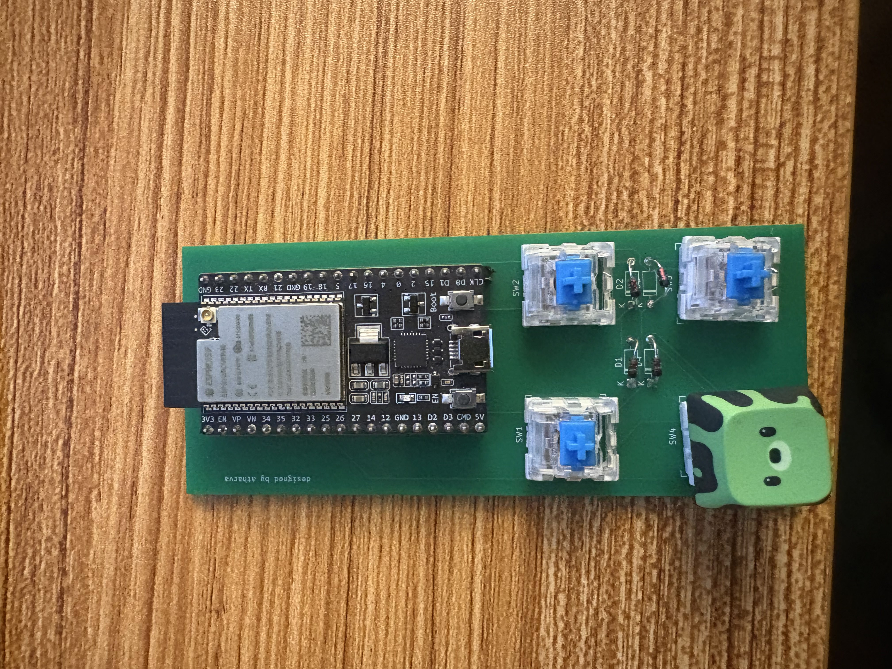

# Macropad
Custom 2x2 Macropad designed in KiCad.

## Hardware
 
- ESP32 DevKitC
- 2x2 (originally planned 3x3) mechanical switch matrix
- 1N4148 diodes, one per switch, for anti-ghosting

## Firmware (ESP-IDF)
 
Scans the matrix continuously, debounces with a combined state-check + time-window approach (needed since the scan loop runs way faster than a human can press a key), and logs `row col` over serial on every clean press.

 
## PC-side listener (Python)
 
Reads the serial output, parses out the row/col pair, and dispatches to whatever action is mapped for that key . Is in `communication/`.

## Images
 
**PCB**
 

 
**Assembled Macropad**

